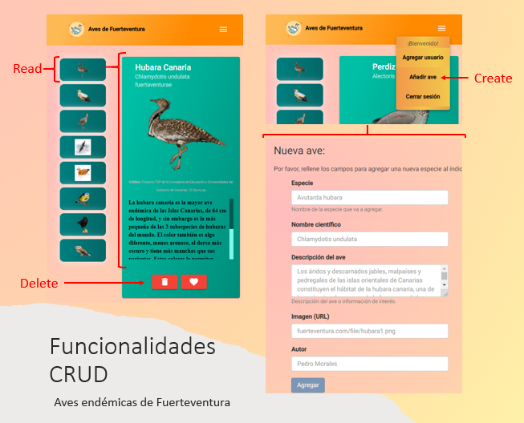
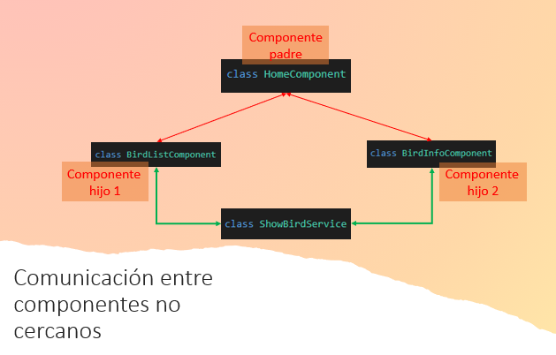

# Fuerteventura Birds-Info 🦅

Trabajo de la asignatura DAW II (Desarrollo de Aplicaciones Web II) consistente en una aplicación de página única (SPA - _Single Page Application_) desarrollada en Angular que, a través del uso de servicios y rutas, establezca una comunicación entre componentes lejanos. 

La aplicación implementa un índice de aves endémicas de la isla de Fuerteventura. Para añadir/eliminar aves del índice es necesario que el usuario haya iniciado sesión en el aplicativo web. 

**Autor** ✒️

* Francisco Javier López-Dufour Morales

## Construido con ⚙️

* Angular Framework: v11.2.13

    * Angular CLI: v11.2.12
    * Node.js. v14.15.4
    * npm package manager: v7.10.0
    * TypeScript: v4.1.5

## Funcionalidades 📋

### Funciones CRUD

La aplicación implementa funcionalidades básicas para Crear, Leer y Borrar aves del índice. 

Para poder borrar o agregar un nuevo ave es necesario haber iniciado sesión en el aplicativo. 



### Servicios

Los servicios en Angular son una parte esencial dentro de la arquitectura de las aplicaciones construidas con este framework. Su principal función es la de proveer datos a los componentes que los consumen y que delegan en ellos la responsabilidad de acceder a la información y la realización de operaciones con dichos datos. 

Se han implementado varios servicios en Angular con el objetivo de:

* comunicar componentes lejanos entre sí  
* capturar la lógica de comunicación con la base de datos

#### Comunicación entre componentes no cercanos

Para la comunicación entre componentes no cercanos se han implementado servicios que se encargan de la comunicación entre estos. 

Por ejemplo:



```typescript
import { Injectable } from '@angular/core';
import { Subject } from 'rxjs';
import { Bird } from 'src/app/models/bird.model';

@Injectable({
  providedIn: 'root'
})
export class ShowBirdService {

  // Esta variable almacenará el id del ave que se mostrará en detalle en la home
  public bird!: Bird;
  public birdDeleted: boolean =false;

  // Esta variable nos permite enviar mensajes a múltiples observadores
  // Permitirá a varios componentes subscribirse al Subject
  // Cada vez que se seleccione mostrar un ave diferente los componentes (BirdInfoComponent) recibirá 
  // el nuevo Id que debe mostrar
  private changeBirdSubject = new Subject<Bird>();

  // Esta variable auxiliar nos facililitar la sintaxis para que nustros componentes se puedan
  // subscribir al Subject
  changeBirdObservable = this.changeBirdSubject.asObservable();

  constructor() {
  }
  
   // Esta función incluye la lógica para enviar el nuevo id a todos los componentes subscritos al Subject 
   sendIdBird(bird: Bird){
    // alert("sendIdBird: " + bird.id);
    this.bird = bird;
    this.changeBirdSubject.next(this.bird);
   }

// ...
}
```


#### Comunicación con Firebase

Para la comunicación con la base de datos se han empleado servicios que capturan la lógica que comunica la aplicación con la base de datos mediante peticiones HTTP. 

Por ejemplo:

* Autenticación: 
    * `auth.service.ts`: realiza la autenticación del usuario con el servidor de la BD. Implementa métodos como `login()`, `autologin()`, `signup()` , `logout()`, `autologout()`, manejo de errores, ...
    * `auth-interceptor.service.ts`: captura las peticiones HTTP que realiza la aplicación y añade un token que identifica al usuario cuando este está autenticado. 
    * `auth-guard.service.ts`: protege las rutas que solo pueden ser accedidas si el usuario está autenticado. 
* Acceso al índice de aves almacenado en Firebase:
    * `post-bird.service.ts`: realiza peticiones HTTP a la BD para leer del índice o agregar nuevos elementos al mismo. 

### Rutas

```typescript
import { NgModule } from '@angular/core';
import { RouterModule, Routes } from '@angular/router';

import { CreateComponent } from './components/create/create.component';
import { HomeComponent } from './components/home/home.component';
import { ErrorComponent } from './components/error/error.component';
import { LogUpComponent } from './components/log-up/log-up.component';
import { LogInComponent } from './components/log-in/log-in.component';
import { AuthGuardService } from '../app/services/auth/auth-guard.service';

const routes: Routes = [
  { path: 'create', component: CreateComponent, canActivate: [AuthGuardService]},
  { path: 'home', component: HomeComponent },
  { path: '', component: HomeComponent },
  { path: 'login', component: LogInComponent },
  { path: 'logup', component: LogUpComponent, canActivate: [AuthGuardService] },
  { path: '**', component: ErrorComponent },
];

@NgModule({
  imports: [RouterModule.forRoot(routes)],
  exports: [RouterModule]
})

export class AppRoutingModule { }
```


### Empleando Angular Material

Para este trabajo se han empleado varios componentes de la librería de Angular Material. Esta librería ofrece componentes web con un diseño Material design, una guía creada por Google. 

Algunos de los componentes utilizados han sido:

* `<mat-action-list>` each item in an action list is a <button> element.
* `<mat-card>` is a content container for text, photos, and actions in the context of a single subject.
* `<mat-toolbar>` is a container for headers, titles, or actions.

### Almacenamiento 💾

Para el almacenamiento del índice hemos empleado **`Firebase Realtime Database`**. Este almacenamiento nos permite almacenar y sincronizar datos en una base de datos NoSQL en la nube en formato JSON. Los datos se mantienen sincronizados en tiempo real con todos los cliente conectados. 


## Deployment 🚀

### Deploy to GitHub Pages 📚

Seguimos los pasos

1. Creamos el repositorio de GitHub para nuestro proyecto

2. Configuramos `Git` en nuestro repositorio local para conectarlo con el repositorio remoto. Los comandos son similares a los siguientes:

```
git remote add origin https://github.com/gitfrandu4/ftv-birds-info
git branch -M main
git push -u origin main
```

3. Create and check out a git branch named gh-pages.

```
git checkout -b gh-pages
```

4. Hacemos build del prouecto utilizando el comando de Angular CLI `ng build`.

```
ng build --output-path docs --base-href /your_project_name/

Nota: /your_project_name/ es el nombre del proyecto especificado en el paso 1. 
Debemos incluir los slashes. 

ng build --output-path docs --base-href=""
```

5. Cuando se completa el build copiamos `docs/index.html` en un nuevo archivo y lo renombramos como `docs/404.html`.

6. Commit + push

7. En el proyecto de Github > Settings > GitHub Pages > Configuramos el sitio para publicar desde la carpeta `docs`.

8. Save

9. Accedemos al enlace donde se ha desplegado el proyecto: https://gitfrandu4.github.io/ftv-birds-info/

Ayuda: https://angular.io/guide/deployment

## Créditos

Créditos de las imágenes empleadas para la demo:

* Proyecto TSP de la Consejería de Educación y Universidades del Gobierno de Canarias.
    * https://www3.gobiernodecanarias.org/medusa/wiki/index.php?title=P%C3%A1gina_principal 
* Enciclopedia de las Aves de España, editada por SEO/BirdLife y la Fundación BBVA en 2008